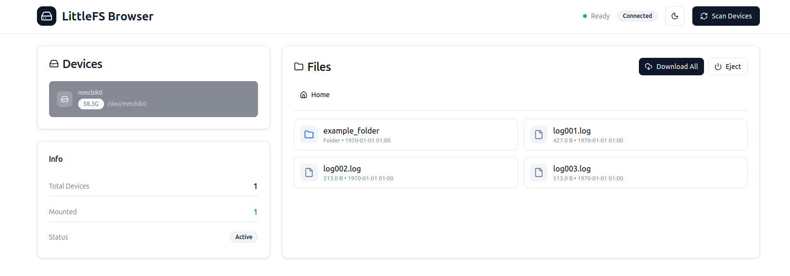

[](https://github.com/FinOrr/littlefs-browser/actions/workflows/release-binary.yml)

# LittleFS Browser

Browse files on LittleFS-formatted SD cards and USB drives from your Linux desktop. 



## Requirements

- Linux (Ubuntu 20.04+ or any Debian-based distro)
- `sudo` access (needed to mount block devices via FUSE)

## Install

### Binary (recommended)

Download the latest binary from the [Releases page](https://github.com/finorr/littlefs-browser/releases/latest):

```bash
chmod +x littlefs-browser-linux-x86_64
sudo ./littlefs-browser-linux-x86_64
```

Nice and easy, just the one file.

### Install script

If you'd rather install it as a system tool (sets up a venv, desktop launcher, etc.):

```bash
curl -sSL https://raw.githubusercontent.com/finorr/littlefs-browser/main/install/install.sh | bash
cd ~/littlefs-browser && ./run.sh
```

Open http://localhost:5000, plug in your device, click **Scan Devices**.

## Usage

1. Plug in your SD card or USB drive
2. Click **Scan Devices**
3. Click your device to mount it
4. Browse and download files
5. Click **Disconnect** when done

## Troubleshooting

**Device not showing up**
```bash
lsblk        # confirm the device is visible to the OS
dmesg | tail # check for kernel errors
```

**Mount fails**

The auto-detection tries common LittleFS parameters. If it fails, the device may use non-standard settings, check what parameters your firmware was compiled with (`block_size`, `read_size`, `prog_size`).

**Port 5000 already in use**

Edit the last line of `app.py` and change the port:
```python
app.run(host='0.0.0.0', port=5001)
```

**littlefs-fuse won't build**
```bash
sudo apt install build-essential libfuse-dev pkg-config
```

## Development

```bash
./start-dev.sh
```

Backend runs on :5000, Vite dev server with hot reload on :5173.

## How it works

- `lsblk` scans for block devices
- `littlefs-fuse` mounts the selected device via FUSE, trying common parameter combinations until one succeeds
- Flask serves the React UI and exposes a small REST API over the mount
- Files are read directly from the FUSE mount point and streamed to the browser

## Uninstall

```bash
rm -rf ~/littlefs-browser
rm -f ~/.local/share/applications/littlefs-browser.desktop
sudo rm -f /usr/local/bin/lfs
```

## Use Cases

- Extract logs from microcontroller SD cards
- Browse filesystems from IoT devices
- Recover data from LittleFS volumes
- Verify files written by embedded systems
- Backup device data before reflashing

## Project Structure

```
littlefs-browser/
├── app.py              # Flask backend
├── templates/
│   └── index.html     # Web interface
├── install.sh         # Installation script
└── README.md          # Documentation
```

## License

MIT License - see LICENSE file for details.

## Acknowledgments

- [littlefs-fuse](https://github.com/littlefs-project/littlefs-fuse) - FUSE driver for LittleFS
- [LittleFS](https://github.com/littlefs-project/littlefs) - The filesystem implementation
- [Flask](https://flask.palletsprojects.com/) - Web framework
